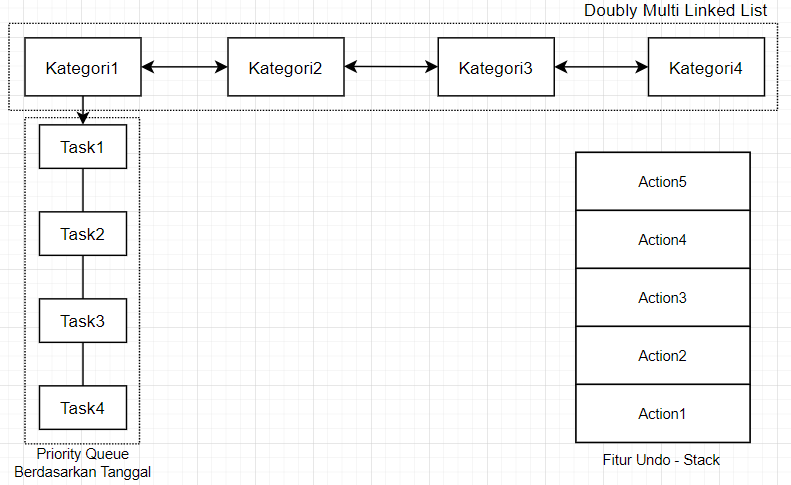
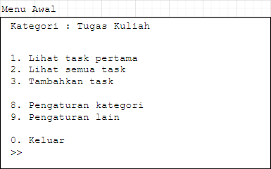
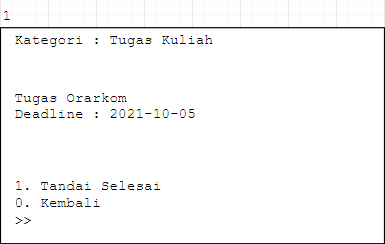
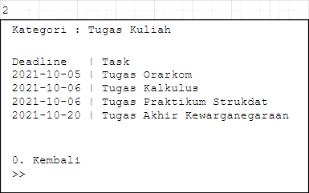
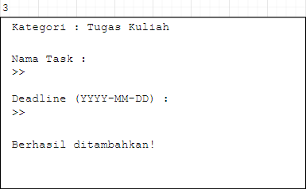
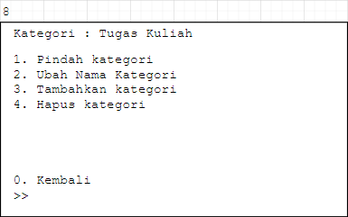
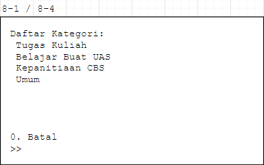
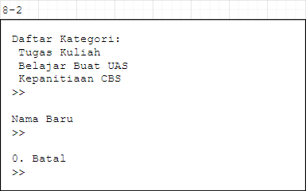
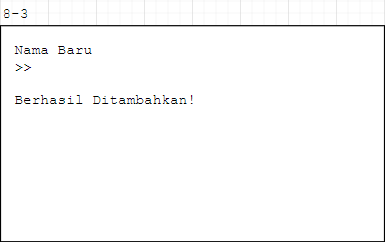
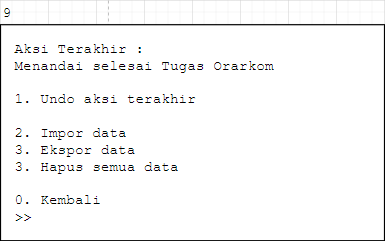

# Sistem To-Do List Pribadi

Anggota Kelompok:
* Fauzan Azmi Dwicahyo (140810200030)
* Anna Safira Dila (140810200034)
* Laura Azra Aprilyanti (140810200036)
---
## Latar Belakang
Mahasiswa merupakan makhluk sosial dan intelektual yang mempunyai banyak kesibukan juga tanggung jawab besar baik untuk dirinya, lingkungan, serta masa depan, yang berada pada porsi yang berbeda-beda antar individu. Selain disibukan dengan tugas, beberapa mahasiswa aktif juga memiliki kegiatan lain di luar akademik baik di dalam kampus maupun di luar kampus, seperti organisasi kampus ataupun organisasi kemasyarakatan. Kegiatan yang begitu banyak tak jarang menimbulkan rasa malas yang membuat tugas menjadi menumpuk, yang akhirnya menjadi beban yang begitu berat.

Permasalahan yang terjadi pada banyak mahasiswa adalah tidak dapat memanajemen waktu. Manajemen waktu merupakan proses perencanaan dan pengendalian secara sadar terhadap waktu yang dihabiskan untuk meningkatkan efektivitas, efisiensi, dan produktivitas. Dengan manajemen waktu bermanfaat untuk meningkatkan produktivitas efisiensi dalam pekerjaan, meningkatkan kepuasaan pekerjaan dan peningkatan peluang, mengurangi kadar stress dan tekanan, dan mencapai target juga tujuan. 

Bagi beberapa orang, manajemen waktu adalah sesuatu yang berat sebab mereka tidak tahu harus memulai dari mana. Manajemen waktu dapat dimulai dari kebiasaan kecil yang terlihat sederhana namun berdampak cukup besar jika dilakukan dengan baik, salah satu contohnya adalah *to-do list*. *To-do list* adalah daftar kegiatan atau pekerjaan yang mesti ditamatkan pada hari yang ditentukan. Membuat *to-do list* dapat membantu mengingat dan fokus, membagi dan mengurutkan pekerjaan, sebagai alat motivasi, melatih kedisiplinan, mudah untuk didelegasikan, dan mengurangi stress. Membuat *to-do list* dapat dilakukan dengan menuliskan ide, membuat skala prioritas, menentukan deadline dan menepatinya, dan memberi hadiah tanda centang pada list yang telah selesai dilaksanakan. 

## Tujuan dan Manfaat
Program ini dibuat dengan tujuan memudahkan mahasiswa dalam mengatur jadwal mereka dengan menuliskannya dalam bentuk daftar pada program ini. Selain itu, program ini juga dapat menjadi pengingat jadwal bagi mahasiswa agar tidak lupa akan rencana yang dimilikinya. Diharapkan mahasiswa merasa terbantu dengan adanya program ini dan dapat mengatur jadwal dan waktunya dengan baik sehingga hal seperti berikut tidak terjadi.

## Penjelasan Aplikasi

 
Skema Struktur Data Aplikasi

Fitur-fitur yang direncanakan:
- Penambahan dan penghapusan kategori task dan task
- Undo penambahan dan penghapusan kategori dan task
- Melihat daftar kategori task dan task
- Pengingat task yang tanggalnya mendekati hari ini (tentatif)
- Impor dan Ekspor data (tentatif)

## Gambar Rancangan Antar Muka
<!--
Buat rancangan antar muka selengkap mungkin sesuai fungsi aplikasinya. rancangan antar muka
diusahakan serapih dan seindah mungkin. tools yang digunakan dalam pembuatan rancangan gambar
dibebaskan sesuai kreatifitas kalian
!-->

## Rencana Pengerjaan Projek
<!--
Dalam kondisi pandemi seperti ini, tidak memungkinkan untuk bertemu bertatap muka. Maka dari itu
jelaskan bagaimana kalian bekerja sama, berkoordinasi, pembagian kerja.Tools apa yang kalian gunakan
untuk bekerja bersama sama cth github, google docs, google meet>ibebaskan sesuai kreatifitas kalian
!-->
Pengerjaan proyek di tengah pandemi saat ini, dapat dilakukan dengan menggunakan software online yang memungkinkan untuk berkomunikasi secara 2 arah, dan melakukan pekerjaan secara bersama-sama. Berikut software dan aplikasi yang digunakan:
- Github
- Visual Studio Code (Live Share)
- Google Docs
- LINE
- Discord
- OneNote

Pekerjaan juga dilakukan dengan membagi pekerjaan pada masing-masing anggota

## Lisensi

MIT License 2021
